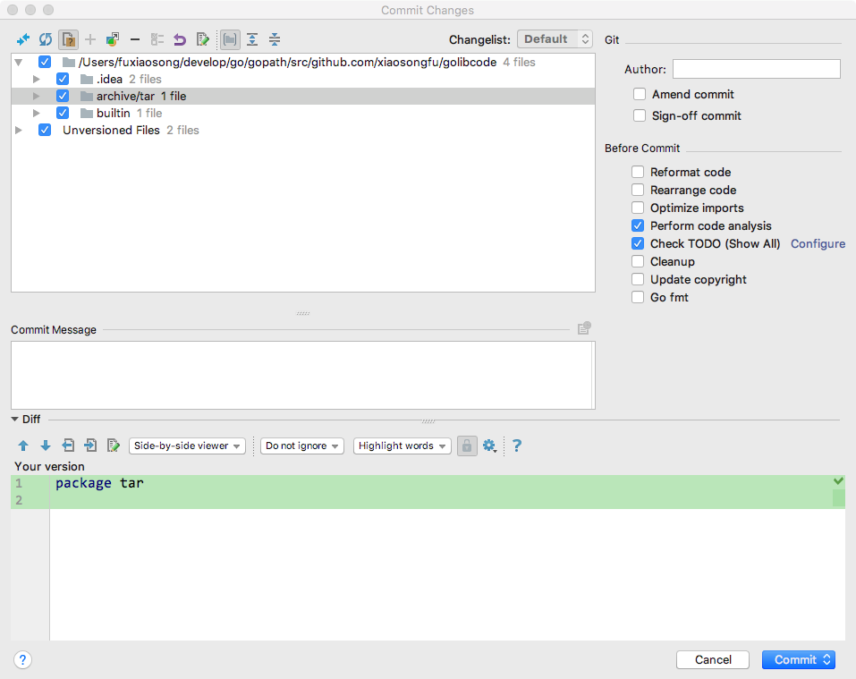
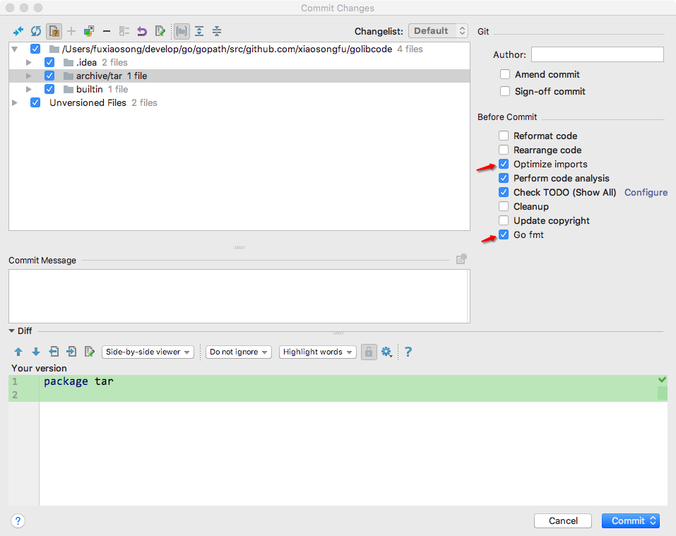

## 4.1 开发

### 4.1.1.设置 GoLand
#### 4.1.1.1 设置 File Watchers
Preferences -> Tools -> File Watchers 里面添加 "go fmt" 和 "goimports"。  
> go fmt  

GoLand 会自动保存，但是还是需要按一下 command+s 来触发这个 File Watchers，它会自动 format 当前文件。  

> goimports  

导入了没有使用的包，或者导入包的顺序不合适，都可以按一下 command+s 来触发这个 File Watchers，它会整理 import，会把标准库和第三方库用一个空行分割开，并且各个部分都按照字母表顺序来排序。

#### 4.1.1.2 设置 commit 时自动 format 和优化 import
设置前：  
  

设置后：  

  

即是需要勾选上 Optimize imports 和 Go fmt。